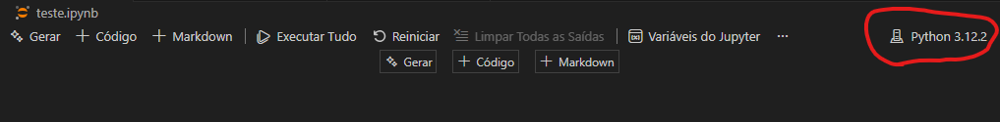

# Guia de Configuração: Python Venv + Jupyter Kernel

Este guia documenta o passo a passo para criar um ambiente virtual isolado e registrá-lo no Jupyter Notebook, garantindo que suas pipelines de dados não tenham conflitos de versão.

## 1. Criar o Ambiente Virtual

Abra o terminal na pasta raiz do projeto **ML-Docs-and-Cats** e execute:

```bash
# Cria uma pasta oculta chamada .venv contendo o Python isolado
python -m venv .venv
```

---

## 2. Ativar o Ambiente

Dependendo do seu sistema operacional, o comando muda:

**Windows (PowerShell):**

```PowerShell
.venv\Scripts\Activate
```

_Se der erro de permissão, execute este comando primeiro: `Set-ExecutionPolicy -ExecutionPolicy RemoteSigned -Scope CurrentUser`_

**Windows (CMD):**

```bash
.venv\Scripts\activate.bat
```

---

**Linux / Mac:**

```bash
source .venv/bin/activate
```

- **Verificação:** Se funcionou, seu terminal mostrará o prefixo `(.venv)` antes do caminho da pasta.

## 3. Instalar o Conector do Jupyter (Essencial)

O Jupyter precisa de uma biblioteca específica para "conversar" com este ambiente virtual. Com o venv ativado, instale:

```bash
pip install ipykernel
```

## 4. Registrar o Kernel (O "Pulo do Gato")

Este passo torna seu venv visível dentro do menu do Jupyter. Substitua nome_do_projeto pelo nome real do seu projeto (não copie os comentários no seu terminal).

```bash
# --name: identificador interno (sem espaços)
# --display-name: nome bonito que aparece no Jupyter
python -m ipykernel install --user --name=pipeline_projeto --display-name "Python (ML-Dogs-and-Cats)"
```

## 5. Instalar Dependências do Projeto

Agora você pode instalar as bibliotecas que vai usar na sua análise no arquivo `requirements.txt`:

Para a célula _dataset.ipynb_:

```bash
pip install -r ../requirements.txt
```

Para a célula _ml-dogs-and-cats.ipynb_:

```bash
pip install -r requirements.txt
```

**Boas Práticas:** Se você instalou outras bibliotecas, sempre salve as versões instaladas para garantir a reprodutibilidade:

```bash
pip freeze > requirements.txt
```

### OBSERVAÇÂO

Realize o comando `pip freeze > requirements.txt` no seu terminal se estiver dentro do diretório **ML-Dogs-and-Cats**

- Ex:

  - Caminho exemplo: `.\machine-learning\ML-Dogs-and-Cats`

## 6. Selecionar o Kernel no Jupyter (VSCode)

1. Abra seu notebook que você criou;
2. Na parte superior direito, clique no botão que está sinalizado na imagem abaixo e selecione a opção _Selecionar outro Kernel..._;



3. Clique em _Kernel do Jupyter..._ e, em seguida, selecione o kernel que foi criado (vai exibir o nome que configuramos ou no --name ou no --display-name).

Agora, o código executado nas células usará as bibliotecas isoladas da pasta `.venv`.

### Comandos úteis

**Sair no Venv (No terminal):**

```bash
deactivate
```

---

**Remover o Kernel (Limpeza):**

Se você deletar a pasta `.venv`, lembre-se de limpar o registro do kernel para ele não aparecer mais no Jupyter do VSCode:

```bash
jupyter kernelspec uninstall pipeline_projeto
```

**Listar kernels cadastrados:**

```bash
jupyter kernelspec list
```

**Recarregar o VSCode após apagar o Kernel:**

1. Abra a Paleta de Comandos: `Ctrl + Shift + P` (Windows/Linux) ou `Cmd + Shift + P` (Mac);
2. Digite e selecione: `Developer: Reload Window`.

Isso reinicia a janela do VS Code e força uma nova varredura dos kernels instalados. O kernel antigo deve desaparecer.

[Retorna para o PROJETO-ML-DOGS-AND-CATS.md](../PROJETO-ML-DOGS-AND-CATS.md)
